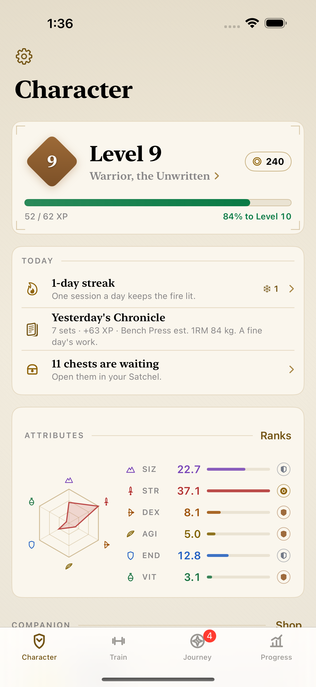
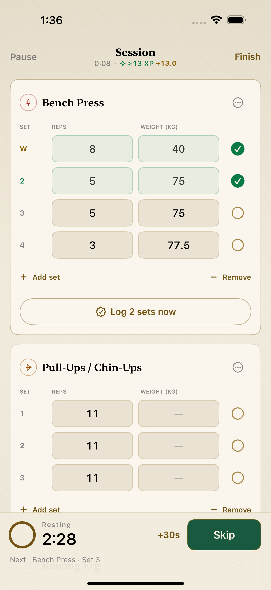
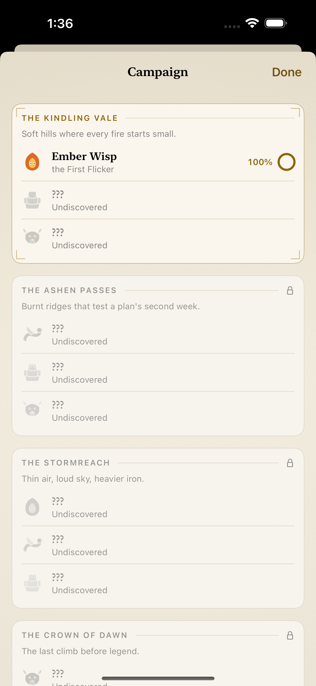
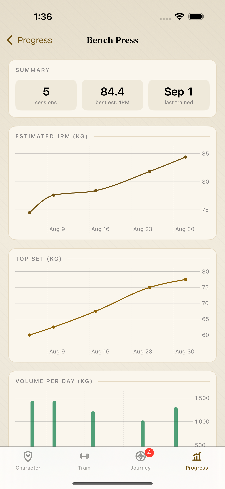
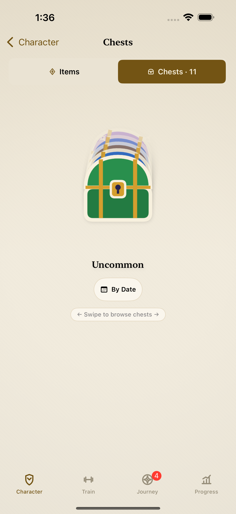

# RPGFit

> Your training is the game.

[](https://github.com/devon4899/FRPG/actions/workflows/ci.yml)


RPGFit is a private-first workout tracker for iPhone and iPad that turns real
training into an RPG progression loop. It combines a detailed workout log with
classes, attributes, quests, boss encounters, companions, equipment, and
rewards—without ads, accounts, paid progression, or analytics.

The project is under active development toward its first public release. The
complete app, widget extension, test suites, privacy manifest, and App Store
assets live in this repository.

<p align="center">
  
  
  
  
  
</p>

The matching 13-inch iPad set is available in
[`docs/screenshots/ipad-13`](docs/screenshots/ipad-13).

## What RPGFit includes

### Training that stands on its own

- Guided sessions with per-set weight and reps, warm-up sets, RPE, pause and
  resume, supersets, automatic rest timing, and recoverable in-progress drafts.
- Quick logging, reusable routines, repeat-last-workout, custom exercises,
  equipment-aware exercise filtering, and a plate calculator.
- Session history with safe editing and deletion, estimated one-rep-max and
  volume charts, personal-record timelines, weekly balance, and CSV export.
- Kilogram and pound support throughout the logging and display pipeline.

### Progression earned through training

- A Ledgerstone placement rite, fitness classes, six character attributes,
  ranks, levels, and prestige.
- Adaptive daily and weekly quests, training streaks, campaign regions, and a
  replay-safe Trial boss ladder.
- Treasure chests, rarity-based equipment, loadout bonuses, companions,
  evolutions, bonds, accessories, and an earn-only coin economy.
- Reward accounting designed so editing or deleting a workout cannot duplicate
  or silently erase previously spent progression.

### Native Apple-platform features

- A home-screen adventure widget and an ActivityKit rest-timer Live Activity.
- Optional, write-only Apple Health workout export.
- Manual backup and restore through the user's private CloudKit database.
- A bundled privacy manifest, Dynamic Type-aware layouts, VoiceOver labels,
  iPhone and iPad support, and no third-party SDKs.

## Product principles

1. **Training is the source of truth.** Game rewards come from completed work,
   never purchases.
2. **The log must be useful without the game.** Detailed sets, routines,
   charts, history, and exports are first-class features.
3. **Local first means local first.** Data stays on the device unless the user
   explicitly exports it or requests an iCloud backup.
4. **Failure must be recoverable.** Saves are validated, versioned, backed up,
   migrated, and surfaced to the user when recovery is required.

## Requirements

- macOS with Xcode 26.3 or newer
- iOS or iPadOS 18.5 or newer
- An Apple Developer account only when running on a physical device or using
  owner-specific services such as app groups, HealthKit, and CloudKit

The app uses only Apple frameworks, including SwiftUI, Charts, ActivityKit,
WidgetKit, HealthKit, CloudKit, and UserNotifications. There are no package
dependencies to install. The project currently builds with Swift 5 language
mode and is verified against Xcode 26.3.

## Run the app

```bash
git clone https://github.com/devon4899/FRPG.git
cd FRPG
open RPGFitMVP.xcodeproj
```

In Xcode, select the shared `RPGFitMVP` scheme and an iOS 18.5+ simulator, then
Run.

Simulator builds do not need provisioning. For a physical device, choose your
own development team and replace the bundle, app-group, and iCloud container
identifiers with identifiers owned by that team. The checked-in identifiers
belong to the production RPGFit app and will not be provisionable by another
developer account.

## Test

Run the unit suite from Xcode with **Product → Test**, or from the command line:

```bash
xcodebuild test \
  -project RPGFitMVP.xcodeproj \
  -scheme RPGFitMVP \
  -destination 'platform=iOS Simulator,name=iPhone 16 Pro,OS=18.6' \
  -only-testing:RPGFitMVPTests \
  CODE_SIGNING_ALLOWED=NO
```

The repository also includes launch smoke tests and a deterministic UI harness
that produces the checked-in App Store screenshots. CI runs the full unit suite
for every push and pull request.

## Project map

| Path | Responsibility |
|---|---|
| `RPGFitMVP/` | App views, workout and game domain models, persistence, integrations, and design system |
| `RPGFitWidgets/` | Home-screen widget and Live Activity presentation |
| `RPGFitMVPTests/` | Swift Testing coverage for workout, progression, migration, and safety invariants |
| `RPGFitMVPUITests/` | Launch checks and deterministic screenshot journeys |
| `docs/` | Architecture notes, design references, release checklist, and screenshots |

See [`docs/ARCHITECTURE.md`](docs/ARCHITECTURE.md) for the data flow and module
boundaries, and [`CONTRIBUTING.md`](CONTRIBUTING.md) before proposing a change.

## Privacy

RPGFit has no account system, ads, analytics, or tracking. Workout and character
data are stored locally by default. Apple Health export is optional and
write-only; CloudKit backup is manual and uses the user's private database. The
app's current policy is also available at the
[RPGFit privacy page](https://devon4899.github.io/rpgfit-site/privacy.html).

## Status and licensing

RPGFit is pre-release software. See [`CHANGELOG.md`](CHANGELOG.md) for the
current development milestone and [`docs/appstore-submission.md`](docs/appstore-submission.md)
for the remaining release gates.

This repository does not currently grant an open-source license. The source is
public for review and collaboration, but reuse and redistribution require the
copyright holder's permission unless a license is added later.

For support, use the [RPGFit support page](https://devon4899.github.io/rpgfit-site/support.html)
or open a reproducible bug report.
