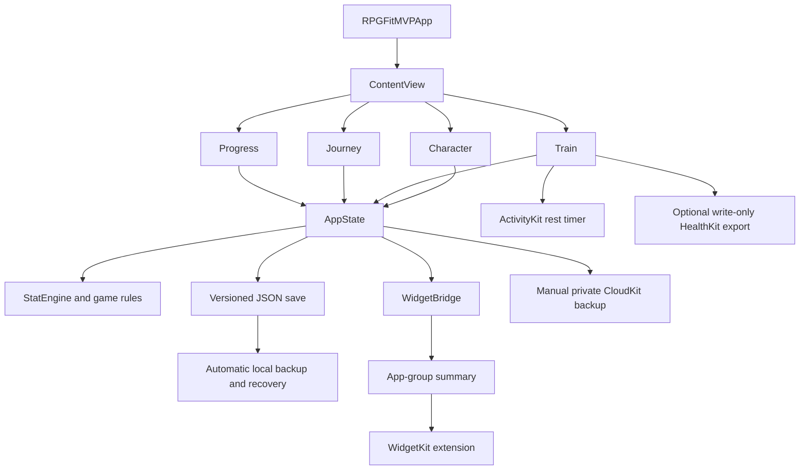

# RPGFit architecture

RPGFit is a native SwiftUI application with one app target, one widget
extension, unit tests, and UI tests. It deliberately has no server component or
third-party runtime dependencies.

## System overview

## App composition

`RPGFitMVPApp.swift` owns the single app-lifetime `AppState` and injects it into
the SwiftUI hierarchy. `ContentView` presents four top-level destinations:

- **Character** answers who the player is, what grew, and what is equipped.
- **Train** starts, resumes, and manages workout sessions and routines.
- **Journey** contains quests, campaign progress, and Trial encounters.
- **Progress** contains history, charts, records, and longer-term insights.

The interface is feature-grouped rather than split into framework modules. The
main boundaries are:

| Area | Primary files |
|---|---|
| App shell and character | `MainViews.swift`, `ProgressHome.swift` |
| Active training and routines | `ActiveWorkout.swift`, `WorkoutViews.swift` |
| Exercise catalog and scoring | `AppSupport.swift`, `CustomExercises.swift`, `EquipmentAvailability.swift` |
| Placement and progression | `PlacementRite.swift`, `Campaign.swift`, `Journey.swift`, `Trials.swift` |
| Items and companions | `Equipment.swift`, `GameViews.swift`, `Companion.swift` |
| Persistence and migrations | `AppState.swift`, `AppSupport.swift` |
| Platform integrations | `HealthKitSupport.swift`, `CloudBackup.swift`, `RestActivitySupport.swift`, `WidgetBridge.swift` |
| Visual language | `Theme.swift`, `Glyphs.swift`, `RPGSymbols.swift` |

## State and persistence

`AppState` is the app's observable source of truth. It owns the `UserProfile`,
workout history, transient notices, persistence status, and mutations that
cross feature boundaries. Tests create in-memory `AppState` instances so they
do not race with the app's real files.

The persisted payload is a versioned `PersistedData` JSON document. The current
load path:

1. Tries the primary save.
2. Falls back to an automatic backup.
3. Falls back to temporary storage used during atomic replacement.
4. Validates decoded state before replacing live state.
5. Runs schema migrations and rewrites upgraded payloads.
6. Preserves an unreadable primary file for diagnosis instead of silently
   overwriting it.

Writes are serialized, debounced during ordinary interaction, and flushed when
the app leaves the foreground. In-progress sessions are stored separately so a
force quit does not discard a workout.

## Workout and reward flow

A completed guided session begins as an `ActiveSessionDraft`, whose exercises
contain exact `DraftSet` values. Completion produces `WorkoutEntry` records with
the performed sets preserved. Those records drive charts, records, quests,
attributes, XP, Trial might, companions, and rewards.

Workout-backed rewards are attributed to their source entries. When history is
edited or deleted, the app recalculates from retained facts and tracks debt for
already-spent rewards. This prevents common gamification exploits such as
repeatedly deleting and re-logging one workout to mint duplicate currency.

## Extension boundary

The widget never reads the full save. `WidgetBridge` writes a small
`WidgetSummary` JSON file into the shared app-group container and asks
WidgetKit to refresh. `RestActivityAttributes.swift` is compiled into both the
app and extension so ActivityKit uses one shared content-state schema.

This narrow boundary keeps the extension independent from the app's large
domain model and reduces the amount of private training data exposed outside
the main process.

## Platform integrations

- **HealthKit:** off by default, requests write permission only, and writes a
  completed session without reading Health data.
- **CloudKit:** invoked only by explicit backup, restore, or delete actions and
  stores one encrypted payload in the user's private database.
- **ActivityKit:** presents the current rest interval as a Live Activity and
  reconciles stale activities after relaunch.
- **UserNotifications:** supports rest-timer completion while the app is not in
  the foreground.

## Testing strategy

The unit suite uses Swift Testing and concentrates on invariants where a small
mistake can corrupt long-lived progression: exact set preservation, XP and
reward replay, placement bands, equipment normalization, custom-exercise
identity, quest windows, migrations, restore validation, and numeric bounds.

XCTest UI targets cover launch behavior and the deterministic screenshot
journey. The screenshot harness seeds a known state, relaunches the app, and
visits real Character, Session, Journey, Progress, and Satchel surfaces rather
than rendering isolated mock views.

## Change guidelines

- Route cross-feature mutations through `AppState` so saving and reward
  accounting remain consistent.
- Persist canonical values (kilograms, kilometers, exact performed sets) and
  convert only at input/output boundaries.
- Add a schema migration and backward-compatibility test for persisted-model
  changes.
- Treat workout edits and deletes as accounting events, not simple array
  mutations.
- Keep widget payloads minimal and backward compatible.
- Pair new game rules with invariant tests; pair meaningful UI changes with
  Dynamic Type and VoiceOver checks.
